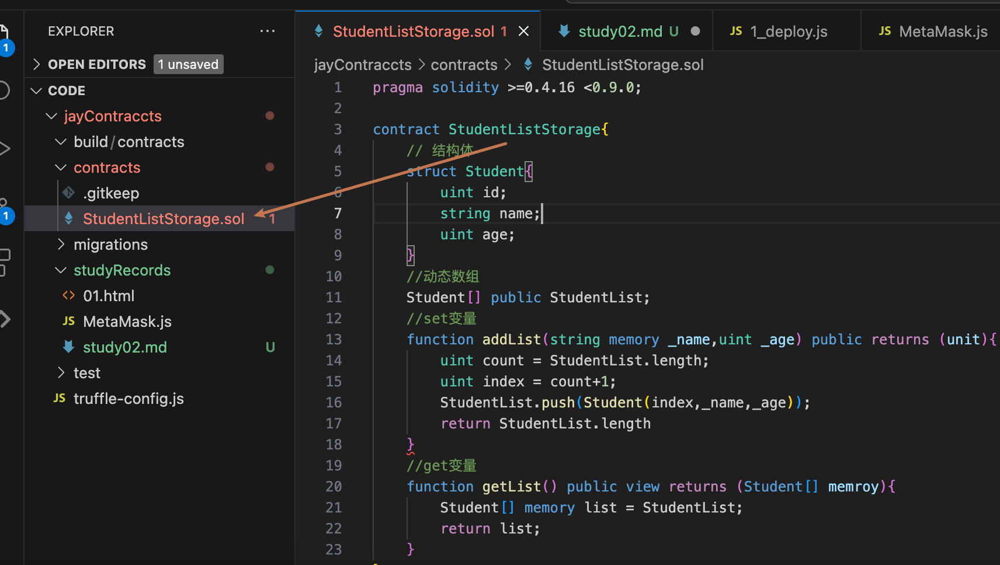
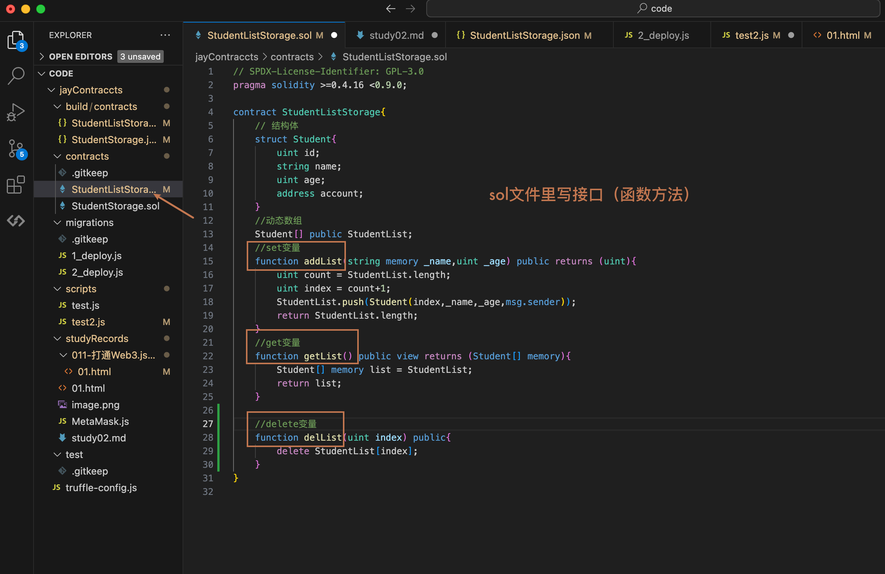
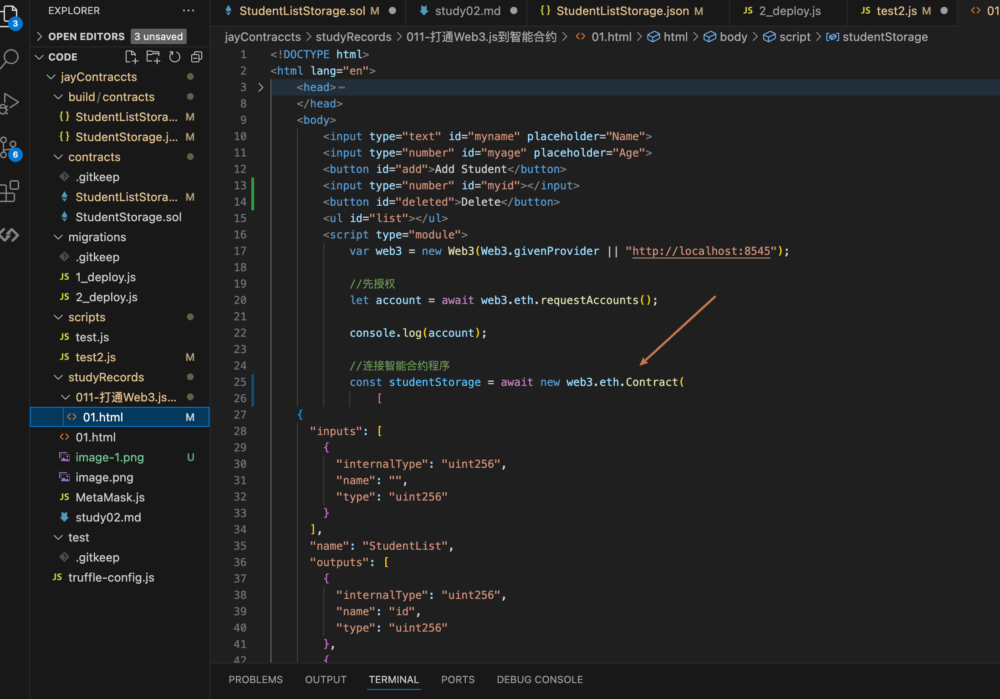

contract 后面的名字要和文件名称一致

function setData(){

}

funtion getData(){

}

函数被标记成view还是pure？
view--试图函数，只访问，不修改状态
pure--纯函数，不访问，不修改

存储
sotrage--
memory--传递的变量中转
calldata--

# 心得02
01-xxx.sol文件里是存放接口（方法函数的）

02-写完sol后要进行保存，再执行truffle migrate命令进行部署
03-部署完成之后对应的xxx.json文件里就会包含abi和地址
04-再通过web3.js库对abi和地址进行调用
