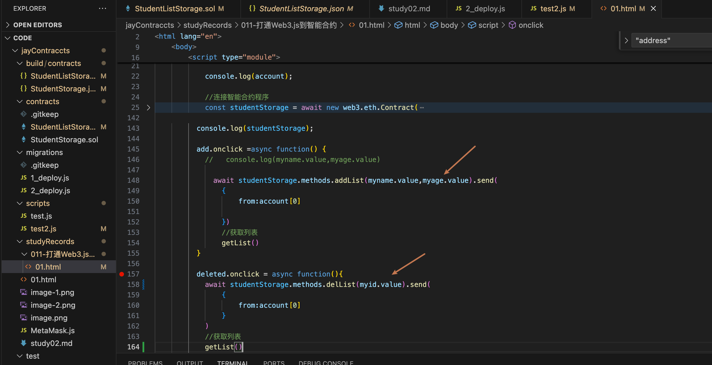
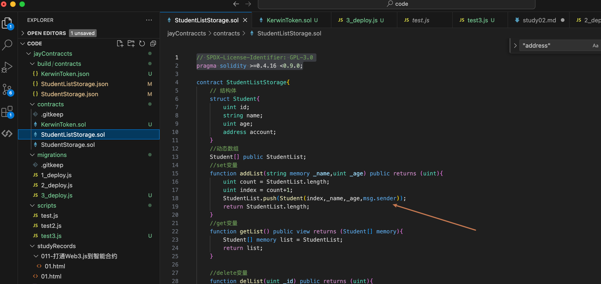
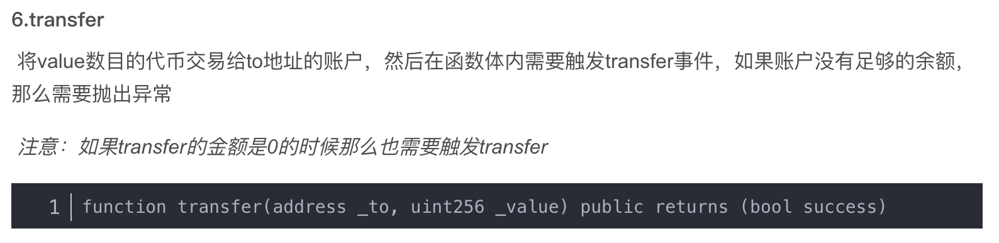
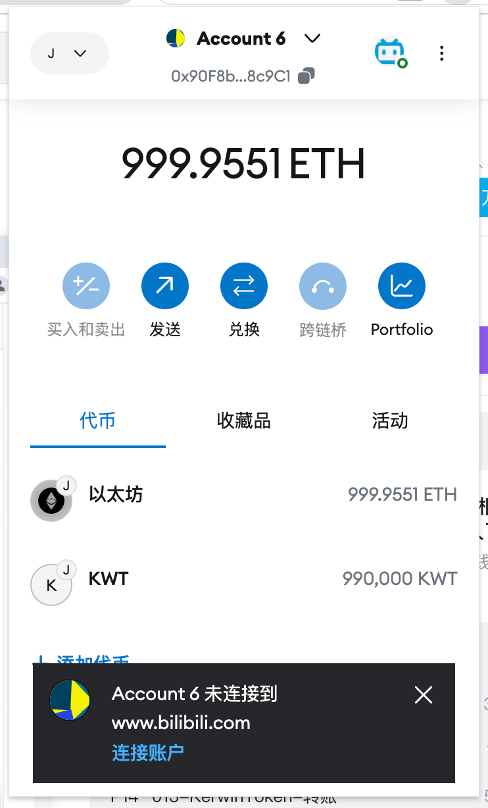
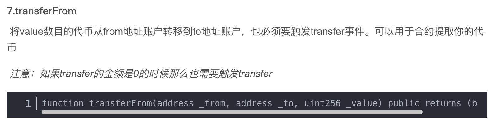
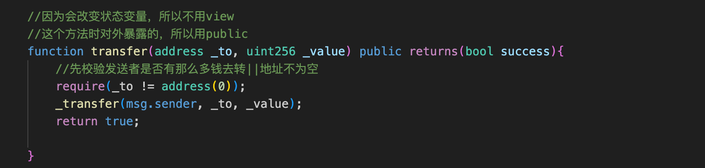
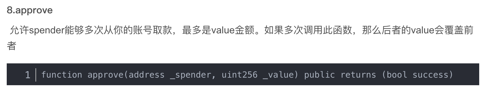
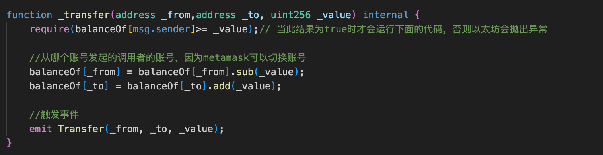
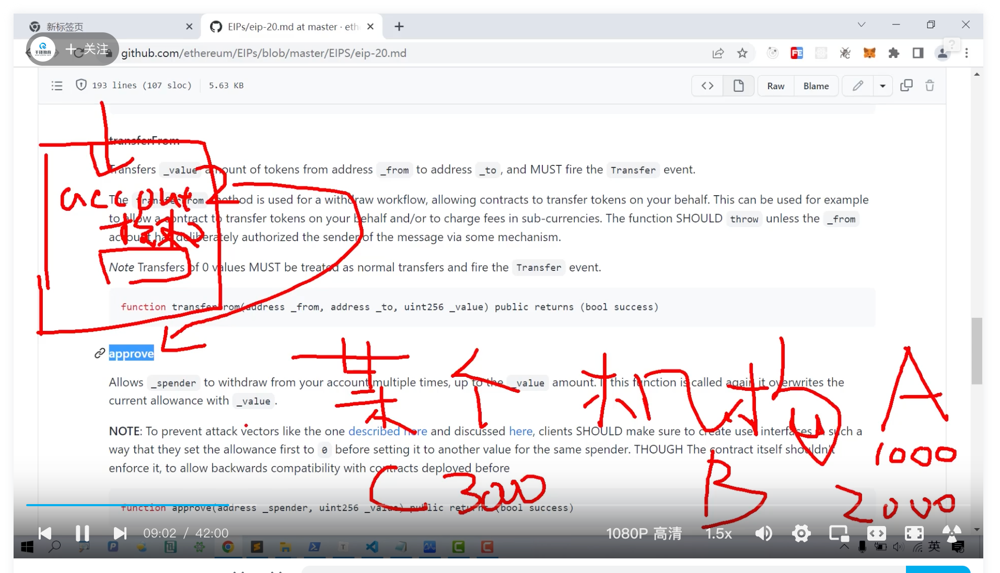

contract 后面的名字要和文件名称一致

function setData(){

}

funtion getData(){

}

函数被标记成view还是pure？
view--试图函数，只访问，不修改状态
pure--纯函数，不访问，不修改

存储
sotrage--
memory--传递的变量中转
calldata--

## 心得02
01-xxx.sol文件里是存放接口（方法函数的）

02-写完sol后要进行保存，再执行truffle migrate命令进行部署
03-部署完成之后对应的xxx.json文件里就会包含abi和地址
04-再通过web3.js库对abi和地址进行调用

## 心得03
html在传递文本框中的值时，需要使用元素id.value来获取，否则会报错
‘’‘text
Uncaught (in promise) Error: invalid BigNumber value (argument="value", valu
’‘’

## 心得04
msg.sender是个全局变量--获取当前部署合约的账号，从当前账号作为from进行交易

## 心得05
比如当前登录的账号是Account6

transfer--是直接使用当前登录的账号进行转账操作

transfer--是需要进行授权，从某个账号转账到某个账号（这个授权一定要注意！！！即使不知道你的密钥和助记词也能转移出去）

授权机构代币，相当于分别把钱存到机构里

